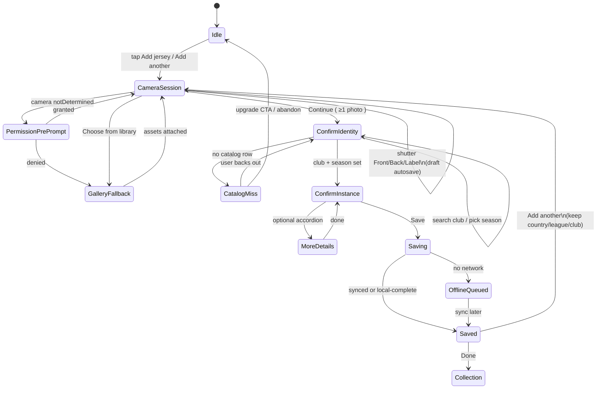

# Jersey registration speed — primary-source research

**Date:** 2026-08-14  
**Product:** KitCollective  
**Question:** How do we make jersey #2 creatable in under 45 seconds from day one, so collectors do not churn after the first item?

## Answer

Win time-to-second-jersey by treating the camera as a **multi-shot session**, not an attachment field, and by treating the form as a **Discogs/Letterboxd attach-to-catalog** action rather than a Shirt Squad–style “every detail you can imagine” wizard. Capture front / back / label in one `expo-camera` `CameraView` session, persist a local draft after every shot, then show a single confirm screen: prefilled club, club-scoped season, and chip picks for type / size / condition. Optional fields stay behind a second disclosure. Do not ship image recognition in MVP; do store photos with a stable `role` (`front` | `back` | `label` | `other`) and keep the label image at OCR-useful resolution so on-device text recognition can attach later without a migration. The category does not publish churn studies proving “manual entry kills apps”; what first-party store listings do show is that jersey catalog apps with large databases and exhaustive fields have almost no install traction, while scan-first collector apps in an adjacent category do.

---

## Decision-relevant findings

### A. Category failure mode — marketing vs measured data

- **Shirt Squad’s own listing sells completeness, not speed.** The App Store copy tells collectors it is “easy to add every detail you can imagine,” then lists photo, kit specification, size, sleeve type, name set, name set font, arm patch, condition, purchase price, date, place, and notes. Missing kits go through a submit-and-wait approval queue. That is a catalog-maintenance product, not a capture-speed product. ([App Store listing](https://apps.apple.com/us/app/shirt-squad-football-collector/id6479617183); [Play listing](https://play.google.com/store/apps/details?id=com.shirtsquad.app&hl=en_US))
- **Shirt Squad’s first-party site makes the queue explicit.** New database shirts need a “clear, flat, full-frontal” thumbnail; sponsor/poppy/patch variants are “not considered new” and belong in notes; missing team/league/manufacturer requires contacting them *before* submitting. That is the exact catalog-dead-end KitCollective’s PRD forbids. ([Shirt Squad site](https://shirtsquadapp.wixsite.com/shirt-squad))
- **Measured traction is tiny relative to the claimed catalog.** Play Store (US, fetched 2026-08-14) shows **1K+ downloads**. App Store shows **6 ratings** at 4.7. Language: English only. Database claim: “100k+ Shirts.” A 100k-row catalog with ~1k Android installs is evidence that catalog size does not create usage. It is **not** a published churn funnel. Do not cite “500 installs after two years” as a live store number; the US Play bucket is now 1K+. ([Play](https://play.google.com/store/apps/details?id=com.shirtsquad.app&hl=en_US); [App Store](https://apps.apple.com/us/app/shirt-squad-football-collector/id6479617183))
- **MyFootballShirts is also catalog-and-community, not capture-speed.** Play: **100+ downloads**. App Store: not enough ratings to display an overview. Own site claims **23,975** jerseys and **1,686** “active collectors” — those figures are first-party marketing on their site, not store-verified installs. The mismatch is consistent with a web-first catalog. How-it-works on their site is account → photograph and catalog *with all details* → community. Premium explicitly sells **“Préremplissage IA de tes fiches maillots à partir des photos”** (AI prefill from photos). That is a first-party admission that photo → fields is the pain, sold as an upgrade rather than the default path. ([Play](https://play.google.com/store/apps/details?hl=en&id=app.myfootballshirts.app); [App Store](https://apps.apple.com/us/app/myfootballshirts/id6761575100); [myfootballshirts.app](https://myfootballshirts.app/))
- **Showboat (adjacent jersey app) also has thin store traction and leans on valuations.** Play: **500+ downloads**. Listing claims “more than 35,000 football shirts” uploaded and markets “market valuations.” KitCollective’s PRD already rejects price estimates. Same pattern: catalog/value claims, not capture speed. ([Play](https://play.google.com/store/apps/details?hl=en_US&id=com.showboat.showboatapp); [App Store](https://apps.apple.com/us/app/showboat-football-shirts/id6743096152))
- **CollX is the adjacent category that *did* win on capture speed — with first-party numbers.** Own site: “Snap a photo of your cards and get the value in seconds.” App Store: **46K ratings** at 4.6; visual search against “20+ million cards.” Play: **1M+ downloads**, 17.2K reviews. Transferable mechanic: the add button *is* the camera; catalog match is the default, manual add is the fallback. **Not transferable:** full visual jersey identification, or making price the north-star. Cards have unique printed identities; shirts have namesets, patches, and lighting variance. CollX’s own Play replies still push “Scan+ (about 95% detection)” — even a well-funded scanner misses, so a jersey MVP cannot depend on CV. ([collx.app](https://collx.app/); [App Store](https://apps.apple.com/us/app/collx-sports-card-scanner/id1581164444); [Play](https://play.google.com/store/apps/details?id=app.collx.android&hl=en_US))
- **Weak evidence (say this out loud):** none of Shirt Squad, MyFootballShirts, or Showboat publish time-to-second-item, form-abandonment, or D1 retention. “Manual cataloging is the documented death of the category” is a KitCollective product claim ([PRD](../Business/PRD.md)), not a competitor-published metric. The honest first-party case is: exhaustive-field jersey apps have not found users; scan-first collector apps in another hobby have.

### B. What “fast” means in interaction design

- **Three hard time limits, unchanged since 1968/1993.** 0.1 s = instantaneous (shutter feedback). 1 s = flow of thought stays intact (chip tap, search results). 10 s = attention stays on the dialogue; longer needs progress UI and users will context-switch. A 45-second *task* is fine; a 10-second *pause* between taps is not. Catalog search, photo save, and draft persist must each land under 1 s on device, or the session dies. ([Nielsen, “Response Times: The 3 Important Limits”](https://www.nngroup.com/articles/response-times-3-important-limits/), citing Miller 1968 and Card et al. 1991)
- **EAS: Eliminate, then Automate, then Simplify.** Cut non-urgent questions; reuse prior answers; remaining fields get defaults and alternative input (camera, chips). “Users rarely change defaults” — prefill last country/league/club (PRD). Do **not** prefill type or condition from the previous jersey (wrong-default risk). Size is the only other candidate for a sticky default; ship it only after telemetry shows the same collector reuses size. ([NN/G EAS](https://www.nngroup.com/articles/eas-framework-simplify-forms/); [NN/G “No Default Values”](https://www.nngroup.com/articles/top-10-application-design-mistakes/))
- **Progressive disclosure is two levels, not a wizard.** Primary display = frequent needs. Secondary = rare. More than two disclosure levels “typically have low usability.” Optional player print, patch, nameset, purchase, notes, authenticity, listing status belong behind one “More details” control — not steps 6–12. ([NN/G Progressive Disclosure](https://www.nngroup.com/articles/progressive-disclosure/))
- **Related fields together; long forms feel like abandonment.** Cognitive-load research: group related questions, ask in conversational order, use branching so people never scan irrelevant fields. Type + size + condition are one “this copy of the shirt” group. Club + season are one “which kit” group. Photos are a prior group. ([NN/G cognitive load in forms](https://www.nngroup.com/articles/4-principles-reduce-cognitive-load/))
- **GOV.UK: start with one thing per page, then merge for repeat power users.** One question per page helps first-time and mobile users, and it gives you per-field analytics and auto-save. The same guidance says user research will tell you when to merge — “for example, if you’re designing an internal service for government users who need to repeat and switch between tasks quickly.” Jersey #2 in a cellar session **is** that repeat task. Start the information architecture as one-thing-per-page; ship jersey #2 as a merged confirm screen. Also: question protocol (why is this field needed *now*), save answers as they go, capture analytics per question. ([GOV.UK form structure](https://www.gov.uk/service-manual/design/form-structure); [GOV.UK question pages](https://design-system.service.gov.uk/patterns/question-pages/))
- **Apple HIG: ask for camera only at the moment of capture, in context.** Request permission when the app clearly needs the resource; wait until people actually use the feature; the current context should explain why. A custom screen before the system alert is allowed. Do not ask camera, photos, push, and tracking on first launch. Photo library is a different permission from camera — do not request it for a camera-only session. ([Apple HIG Privacy](https://developer.apple.com/design/human-interface-guidelines/privacy); [AVFoundation authorization](https://developer.apple.com/documentation/avfoundation/requesting-authorization-to-capture-and-save-media); [`NSCameraUsageDescription`](https://developer.apple.com/documentation/bundleresources/information-property-list/nscamerausagedescription))
- **Android: gallery must use the system photo picker, not broad media permission.** The photo picker grants access only to selected items; `READ_MEDIA_IMAGES` is restricted. Expo ImagePicker’s “no permissions request is necessary for launching the image library” matches this. ([Android photo picker](https://developer.android.com/training/data-storage/shared/photopicker); [shared media](https://developer.android.com/training/data-storage/shared/media))

### C. Expo / RN camera-first (SDK 57 docs, 2026)

Use **`expo-camera` `CameraView` as the primary capture surface**. Use **`expo-image-picker` only as gallery escape hatch** (and as the web default). Do not use `ImagePicker.launchCameraAsync` as the main path: it is one system-camera shot, then dismiss — it cannot run a front/back/label session.

| Capability | First-party? | iOS | Android | Expo Web | Notes |
| --- | --- | --- | --- | --- | --- |
| In-app preview + repeated `takePictureAsync` | Yes, `expo-camera` | Device only | Device only | Yes, degraded | Only one preview may be mounted. Unmount on blur. ([docs](https://docs.expo.dev/versions/latest/sdk/camera/)) |
| JPEG quality 0–1 on capture | Yes | Yes | Yes | Partial | Default `quality: 1`. `skipProcessing: true` is faster but drops orientation correction — do not use for user-facing photos. `onPictureSaved` lets the promise resolve immediately so the next shot is not blocked. |
| `pictureSize` / available sizes | Yes | Yes (same list per iOS) | Device-varying | — | Fetch via `getAvailablePictureSizesAsync`. Keep label shots larger than front/back. |
| Barcode / QR in preview | Yes, built into `expo-camera` | Yes | Yes (ML Kit / Google code scanner) | Yes | Types: aztec, ean13, ean8, qr, pdf417, upc_e, datamatrix, code39, code93, itf14, codabar, code128, upc_a. Plugin `barcodeScannerEnabled: false` **reduces app size** if unused. `expo-barcode-scanner` is **deprecated since SDK 51**. |
| OCR / label text | **No Expo first-party module** | Native Vision later | ML Kit later | No | Design data model now; do not add a third-party OCR wrapper in MVP. |
| System gallery, multi-select | Yes, `expo-image-picker` | iOS 14+ | Yes | Yes | `allowsMultipleSelection`, `quality` 0–1 (Android/iOS). Library launch does not require a permissions prompt. Camera launch always does. Web: must be called from a user gesture; `cancelled` is unreliable. ([docs](https://docs.expo.dev/versions/latest/sdk/imagepicker/)) |
| On-device crop / resize / compress | Yes, `expo-image-manipulator` | Yes | Yes | Yes | `resize` + `saveAsync({ compress, format: JPEG })`. JPEG default; PNG is lossless and slower. ([docs](https://docs.expo.dev/versions/latest/sdk/imagemanipulator/)) |
| Save to Photos | `expo-media-library` | Needs add/read usage strings | Needs permission | N/A | **Do not require this on the critical path.** Capture into app cache; upload from there. |
| Local draft DB | Yes, `expo-sqlite` | Yes | Yes | Yes | Official, Expo Go, web included. ([docs](https://docs.expo.dev/versions/latest/sdk/sqlite/)) |
| Web camera URIs | `expo-camera` | — | — | Base64 only | “local file system paths are unavailable in the browser.” HTTPS (or localhost) required. Chrome cross-origin iframes need `allow="microphone; camera;"`. |

**Permissions to ship**

- iOS: `NSCameraUsageDescription` with a concrete string (“Take photos of the front, back, and label of your jersey”). Do not add `NSPhotoLibraryUsageDescription` until the user taps Gallery. Prefer `NSPhotoLibraryAddUsageDescription` only if you later offer “Save to Photos.”
- Android: `CAMERA` from `expo-camera`. Do not add `RECORD_AUDIO` unless you record video (`recordAudioAndroid: false`). Do not request `READ_MEDIA_IMAGES` for gallery — picker is enough.
- Ask camera permission on the first shutter intent, after a one-line pre-prompt, never on app launch. Aligns with Apple HIG and the PRD’s push-permission rule.

**Multi-shot session recipe (first-party APIs only)**

1. Mount one `CameraView` (`facing: 'back'`).
2. Overlay three slots: Front, Back, Label. None required to *start*; at least one photo required to *save* a jersey; recommend all three (PRD).
3. `takePictureAsync({ quality: 0.8, onPictureSaved })` so the shutter returns immediately.
4. Write the file into the draft (SQLite row + cache URI) before the next shot.
5. After capture, run `expo-image-manipulator` in the background: front/back max edge ~1600 px JPEG; **label max edge ~2400 px** (OCR later). Never block the shutter on this.
6. “Choose from gallery” is a text button, not the primary CTA.

### D. On-device recognition path (post-MVP, design now)

**What can read a size/brand label (later)**

- **Apple Vision `VNRecognizeTextRequest`:** on-device, privacy-preserving, real-time or offline. Fast vs Accurate recognition levels; results are `VNRecognizedTextObservation` with string + confidence + bounding box. Language support depends on revision + level (`supportedRecognitionLanguages`). Fast path is Latin-oriented; Accurate is ML-based on words/lines. For live camera, Apple’s own sample disables language correction and restricts `regionOfInterest` for speed. ([Recognizing text in images](https://developer.apple.com/documentation/vision/recognizing-text-in-images); [WWDC19 Text Recognition](https://developer.apple.com/videos/play/wwdc2019/234/); [Extracting phone numbers](https://developer.apple.com/documentation/vision/extracting-phone-numbers-from-text-in-images))
- **Google ML Kit Text Recognition v2:** on-device, Latin/Chinese/Devanagari/Japanese/Korean. Explicitly positioned to “automate data-entry tasks such as processing credit cards, receipts, and business cards.” Returns blocks → lines → elements → symbols with boxes and confidence. Latin is real-time on most devices. iOS bundled Latin SDK ≈ **38 MB** per script. Input rule: each character ideally **≥ 16×16 pixels** (no accuracy gain above 24×24). Fill the frame with the label; do not OCR a distant full-shirt shot. ([ML Kit overview](https://developers.google.com/ml-kit); [Text recognition v2](https://developers.google.com/ml-kit/vision/text-recognition/v2); [Android](https://developers.google.com/ml-kit/vision/text-recognition/v2/android); [iOS](https://developers.google.com/ml-kit/vision/text-recognition/v2/ios))

**What must wait**

- Identifying club/season from the *front* of the jersey is visual search (CollX-class), not OCR. No Expo or Apple/Google turnkey API does this for football kits. Do not pretend label OCR will fill `clubId`.
- Expo has **no first-party OCR module**. A later implementation is a custom Expo native module (dev client / CNG) wrapping Vision on iOS and ML Kit on Android — not an npm OCR toy in JS.
- Expo Web will not run on-device Vision/ML Kit. Web registration stays gallery + manual fields.

**What the label actually contains (so the parser is allowlisted)**

Typical football size/brand labels are Latin print: manufacturer wordmark (Nike, adidas, Puma, Hummel, …), size codes (`S`/`M`/`L`/`XL`/`XXL` or EU numbers), sometimes year, “Made in …”, composition. That is a **constrained parse** over OCR candidates mapped onto catalog enums — not free text becoming truth (PRD). User must confirm. Low-confidence or unmatched strings stay in `ocrTextRaw` and never write `size` / `manufacturerId` silently.

### E. Analog products — transferable mechanics (not UI copies)

| Product | First-party mechanic | Transfer to KitCollective |
| --- | --- | --- |
| **Discogs** | Barcode scanner lives *inside search*. Scan → canonical **release** (not master) → Add to Collection → *then* condition, notes, folder. Not all releases have barcodes. After add, a confirmation lets you open the item. Default collection folder is a setting. ([iOS search](https://support.discogs.com/hc/en-us/articles/360014043894-How-To-Search-In-The-Database-When-Using-The-Discogs-iOS-App); [iOS add](https://support.discogs.com/hc/en-us/articles/360014145653-How-To-Add-To-Your-Collection-On-iOS); [Android add](https://support.discogs.com/hc/en-us/articles/360013936133-How-To-Add-To-Your-Collection-On-Android); [collection](https://support.discogs.com/hc/en-us/articles/360007331534-How-Does-The-Collection-Feature-Work)) | Attach the user’s copy to a canonical catalog row, then instance fields. Do not invent the kit in the form. Condition is after identity. “Add another” is a first-class action. **Do not** make barcode the primary jersey path — hang tags are thrown away; garment labels are not EAN-reliable. Keep `expo-camera` barcode support *off* in MVP (`barcodeScannerEnabled: false`) to save binary size; the CameraView still exists for later. |
| **Letterboxd** | Search a canonical film → `+` log. Date, review, tags are optional. Watchlist is a one-tap clock. Logging marks watched. Import exists for backlog. ([FAQ](https://letterboxd.com/faq/); [Welcome](https://letterboxd.com/welcome/)) | Club/season search must feel like film search: type three letters, pick a canonical row. Optional review ≡ our notes. Do not make the collector *author* the kit. |
| **Vinted** | Official upload order: **photos first** (up to 20), then title/description, category, brand (or “No brand”), condition, price, package. First pic = full view, no collages. Different angles + close-ups of labels/logos with **readable text**. Own photos only. Branded clothing: front, back, then close-ups of neck label, care tag, stitching. ([step by step](https://www.vinted.com/help/375-uploading-an-item-step-by-step); [what photos](https://www.vinted.com/help/48?access_channel=hc_topics); [branded items](https://www.vinted.com/help/8/601-how-to-take-photos-of-branded-items); [tips](https://www.vinted.com/help/377-tips-for-great-photos)) | Camera session before form. Recommend front / back / label with readable label text (exactly what later OCR needs). Do not require 20 photos. Do not require price. |
| **eBay** | At least one picture required; first is the search thumbnail; up to 24. Mobile: Library, File, or **Take photos**. Desktop can push a draft to phone for camera. ([eBay UK help](https://www.ebay.co.uk/help/selling/listings/adding-pictures-listings?id=4148)) | Photos are not optional decoration. First photo = collection card. Phone is the capture device even if metadata is reviewed later. |
| **CollX** | Camera is identification. Manual add from the database exists when the card is not in hand. Listing fields (status, price, qty, purchase) were recently added *onto scan results*, not as a prior wizard. ([App Store “What’s New” 4.0.4](https://apps.apple.com/us/app/collx-sports-card-scanner/id1581164444); [collx.app](https://collx.app/)) | Put instance fields on the *result* of identity (club/season), not before photos. Keep a manual catalog search for when the shirt is in a box and the user is on the sofa. |

Depop: no first-party help article was retrieved in this pass that documents a camera-session listing flow with the same specificity as Vinted. Do not cite secondary “how to sell on Depop” blogs.

---

## Recommended MVP flow

### Time budget for jersey #2 (hard: < 45 s)

Assumes camera permission already granted (jersey #1), last country/league/club prefilled, catalog hit, no optional fields.

| Step | Budget | Interaction |
| --- | ---: | --- |
| Open camera (prefilled context chip visible) | 1 s | One tap from “Add another” |
| Front / back / label shots | 18 s | Stay in `CameraView`; 3× shutter |
| Confirm screen paints (photos + prefill) | 1 s | Must be < 1 s (Nielsen flow) |
| Confirm club (or change) | 2 s | Prefill accepted |
| Season (club-scoped list / search) | 8 s | Most variable required field |
| Type, size, condition chips | 4 s | One screen, thumb-reach |
| Save + land on next camera | 2 s | Draft flushed, photos reset, catalog kept |
| **Total** | **~36 s** | ~9 s buffer for a mis-tap or extra gallery shot |

**If this budget slips, the leak is almost always season pick or a catalog miss — not photos.** Hierarchical country → league → club on every jersey will blow 45 s. Search + recents + prefill is the default; drill-down is a filter, not the happy path.

Jersey #1 is allowed to be slower (permission, first search, learning the three slots). The north-star metric remains **median time from jersey #1 createdAt to jersey #2 createdAt < 5 minutes** (PRD).

### State machine



Draft is written on every transition after `CameraSession` starts. Killing the app mid-session restores `CameraSession` or `ConfirmIdentity` with photos intact.

### Screen-by-screen field order

**1. Camera session (critical path)**  
Slots: Front, Back, Label. Primary shutter. Secondary: gallery. Show last club as a non-blocking chip (“Brøndby — change”) so the collector knows prefill is alive. Do not ask fields here.

**2. Identity (critical path)**  
- Club: search-first (Letterboxd). Recents + prefill pinned. Country and league are filters, not required steps.  
- Season: list scoped to selected club, newest first, with a search field.  
Never free-text club names (PRD). Catalog miss → upgrade CTA, draft kept.

**3. Instance (critical path, one screen)**  
Type: Home / Away / Third / GK (required, no default — NN/G: a wrong default is worse than a tap).  
Size: chips from catalog enum.  
Condition: chips from catalog enum.  
Primary button: **Save**. Secondary text: “Add details”.

**4. More details (not on the 45 s path)**  
Player print + number, sleeve patch, nameset, purchase place/date, purchase price (always private), notes, authenticity (default **unknown**, do not even show unless they open this), listing status (default **not available**).

**5. Saved**  
Toast + two actions: **Add another** (default focus) and **View jersey**. Add another remounts camera with photos cleared and identity prefilled. Do not return to collection overview (PRD).

### Offline / drafts

- Table `jersey_drafts` in `expo-sqlite` (official, iOS/Android/Web).  
- Columns: `id`, `state`, `photos_json`, `catalog_json`, `instance_json`, `optional_json`, `updated_at`, `sync_status`.  
- Photo blobs live in app cache (`File` / cache directory); drafts store URIs + role.  
- Sync: create jersey + upload photos when online; idempotency key = draft `id`.  
- Never block Save on upload. Local-complete is a successful save for the 45 s clock; telemetry should distinguish `saved_local` vs `saved_synced`.

### Expo Web degradation

PRD: public web is read-only sharing, not a registration app. If Expo Web still boots the registration route as a technical surface:

- Default **gallery-first** (`launchImageLibraryAsync`, `allowsMultipleSelection: true`).  
- Camera is available but URIs are base64, must be user-gesture, and is weaker. Do not invest in a `CameraView` session on web.  
- Same draft schema (`expo-sqlite` supports web).  
- Do not promise the 45 s budget on web.

---

## Data model hooks for later OCR / label recognition

No migration later if MVP photos already carry role, resolution, and a vacant OCR envelope.

```text
Photo {
  id: uuid
  jerseyId: uuid | null          // null while draft
  draftId: uuid
  role: 'front' | 'back' | 'label' | 'other'
  source: 'camera' | 'gallery'
  localUri: string
  remoteUrl: string | null
  mime: 'image/jpeg'
  width: int
  height: int
  bytes: int
  capturedAt: datetime
  // vacant until v2 — do not populate in MVP
  ocrStatus: 'none' | 'pending' | 'done' | 'failed'
  ocrEngine: 'vision' | 'mlkit' | null
  ocrTextRaw: string | null
  ocrCandidates: {
    size?: { value: string, confidence: number, bbox: Box }
    manufacturer?: { value: string, confidence: number, bbox: Box }
    year?: { value: string, confidence: number, bbox: Box }
  } | null
}

Jersey {
  catalogClubId, catalogSeasonId, catalogType, size, condition
  authenticity: 'unknown' | 'assessed' | 'verified'   // default unknown
  // instance optionals…
  // NEVER copy catalog names; point at canonical ids (PRD)
}

UserCapturePrefs {
  lastCountryId, lastLeagueId, lastClubId
  // lastSizeId reserved; do not write until telemetry says so
}
```

**Rules**

- Catalog fields remain canonical IDs. OCR may *propose* `size` / manufacturer; the user confirms. Unconfirmed OCR never becomes search truth.  
- Keep label images larger than front/back (ML Kit 16×16 px/character).  
- `role` is assigned in the camera UI now, even without OCR — that is the whole point of the three slots.  
- A future `ocrStatus` worker can run on-device against existing `label` photos; no re-upload required if originals are retained.

---

## Telemetry (emit from day one)

PRD already requires timestamps on every create, camera vs gallery, form start/abort with field, catalog-miss CTA. Add these so the 45 s / 5 min gates are diagnosable:

| Event | Properties that matter |
| --- | --- |
| `registration_started` | `jerseyIndex` (1, 2, …), `source` (`fab` / `add_another` / `restored_draft`) |
| `camera_permission_preprompt_shown` | — |
| `camera_permission_result` | `granted` / `denied` / `blocked` |
| `photo_captured` | `role`, `source` (`camera`/`gallery`), `width`, `height`, `elapsedMsFromSessionStart` |
| `photo_session_completed` | `count`, `roles[]`, `durationMs` |
| `draft_saved` / `draft_restored` | `state`, `photoCount` |
| `identity_prefill_shown` | `countryId`, `leagueId`, `clubId` |
| `identity_prefill_accepted` / `identity_prefill_changed` | `field` |
| `catalog_search` | `field` (`club`/`season`), `queryLength`, `resultCount`, `latencyMs` |
| `catalog_miss_shown` / `catalog_miss_cta_clicked` | `field`, `query` (hashed or truncated) |
| `instance_field_set` | `field` (`type`/`size`/`condition`) |
| `optional_section_opened` | — |
| `registration_abandoned` | `lastState`, `lastField`, `elapsedMs`, `photoCount` |
| `jersey_saved` | `elapsedMs`, `photoCount`, `roles[]`, `prefillUsed`, `addAnother`, `saveChannel` (`local`/`synced`), `platform` (`ios`/`android`/`web`) |
| `jersey_created_clock` | `createdAt` (server + client) — already in PRD |
| `time_to_second_jersey` | `deltaMs` from jersey 1 `createdAt` (compute server-side too) |

**Gate:** median `jersey_saved.elapsedMs` for `jerseyIndex >= 2` < 45_000. Median `time_to_second_jersey` < 300_000. If `catalog_miss_shown` correlates with abandon, the leak is seed coverage, not UI.

---

## What not to build in MVP

- Full CV jersey identification (CollX-for-shirts). Camera + `role` is the hook; the model is not.  
- Price estimation or “what your collection is worth” (Showboat’s pitch; PRD non-goal; most-complained feature in-category per PRD).  
- Free-text club / league / season as a way out of a catalog miss. Upgrade CTA only.  
- Multi-step wizard that asks profile, KYC, push, or photo-library permission before the first shutter.  
- `ImagePicker.launchCameraAsync` as the primary camera (one-shot system UI).  
- `expo-barcode-scanner` (deprecated). Barcode-as-primary-add (Discogs works because records have EAN; jerseys do not).  
- Requiring all three photos. Recommend them; require one.  
- Prefilling type/condition; asking authenticity on the critical path.  
- Saving to the system photo library as a blocker.  
- On-device or cloud OCR in the binary.  
- Web-camera investment. Gallery-first if Expo Web registration exists at all.  
- Shirt Squad–style “submit this kit to the global DB before you can own it.” User collection row points at canonical catalog; missing catalog is premium propose, 48 h SLA (PRD).

---

## Open questions / weak evidence

1. **No competitor-published funnel** for time-to-second-jersey. Store install buckets and rating counts are the only first-party traction numbers. Treat them as circumstantial.  
2. **MyFootballShirts’ 1,686 collectors vs 100+ Play downloads** is unexplained without their analytics. Likely web-primary. Do not use their site counters as app MAU.  
3. **Season pick is the unbudgeted risk.** If a club has 40 seasons, an unscoped picker will miss 45 s. Needs a club-scoped, newest-first list plus search — validate in closed beta with real Superliga collections.  
4. **Size as sticky default** is theoretically justified (NN/G defaults for repetitive tasks) but not in the PRD. Measure first.  
5. **Label OCR accuracy on vintage kits** is unknown. Heat-pressed / washed / Cyrillic / Japanese manufacturers will fail Latin-fast Vision. Plan user confirmation, not silent fill.  
6. **Apple HIG Privacy page** did not return a stable fetch in this session; guidance cited is from Apple’s published HIG privacy text as indexed 2026-08-14 plus AVFoundation permission docs. Re-read the live HIG page before App Review copy is locked.  
7. **Depop’s official listing-camera help** was not retrieved; Vinted’s is the clothing-primary source used here.

---

## Sources

| URL | What it supports |
| --- | --- |
| https://apps.apple.com/us/app/shirt-squad-football-collector/id6479617183 | Shirt Squad fields, English-only, 6 ratings, submit-for-approval |
| https://play.google.com/store/apps/details?id=com.shirtsquad.app&hl=en_US | Shirt Squad 1K+ downloads, 100k+ shirt claim |
| https://shirtsquadapp.wixsite.com/shirt-squad | Submission rules, variants-in-notes, contact-before-missing-team |
| https://apps.apple.com/us/app/myfootballshirts/id6761575100 | MFS listing, no rating overview, 7 languages, IAP |
| https://play.google.com/store/apps/details?hl=en&id=app.myfootballshirts.app | MFS 100+ downloads |
| https://myfootballshirts.app/ | 23,975 jerseys / 1,686 collectors (first-party, unverified); AI prefill as premium; 3-step how-it-works |
| https://play.google.com/store/apps/details?hl=en_US&id=com.showboat.showboatapp | Showboat 500+ downloads, valuation pitch, 35k shirts claim |
| https://apps.apple.com/us/app/showboat-football-shirts/id6743096152 | Showboat App Store copy |
| https://collx.app/ | Scan-to-value-in-seconds positioning |
| https://apps.apple.com/us/app/collx-sports-card-scanner/id1581164444 | 46K ratings; camera = identity; listing fields on scan results |
| https://play.google.com/store/apps/details?id=app.collx.android&hl=en_US | CollX 1M+ downloads; Scan+ ~95% in developer replies |
| https://www.nngroup.com/articles/response-times-3-important-limits/ | 0.1 / 1 / 10 second limits |
| https://www.nngroup.com/articles/eas-framework-simplify-forms/ | Eliminate / Automate / Simplify; camera as alternative input; defaults |
| https://www.nngroup.com/articles/top-10-application-design-mistakes/ | Defaults speed repetitive tasks; users rarely change them |
| https://www.nngroup.com/articles/progressive-disclosure/ | Two-level disclosure; don’t hide frequent actions |
| https://www.nngroup.com/articles/4-principles-reduce-cognitive-load/ | Group related fields; progressive / one-thing-per-page |
| https://www.gov.uk/service-manual/design/form-structure | Question protocol; one thing per page; merge for repeat power users; autosave; per-question analytics |
| https://design-system.service.gov.uk/patterns/question-pages/ | One question per page pattern |
| https://developer.apple.com/design/human-interface-guidelines/privacy | Ask permission in context, not at launch |
| https://developer.apple.com/documentation/avfoundation/requesting-authorization-to-capture-and-save-media | Camera vs photo-library keys; check status before session |
| https://developer.apple.com/documentation/bundleresources/information-property-list/nscamerausagedescription | Required camera usage string |
| https://developer.android.com/training/data-storage/shared/photopicker | Gallery without broad storage permission |
| https://developer.android.com/training/data-storage/shared/media | Prefer photo picker over `READ_MEDIA_IMAGES` |
| https://docs.expo.dev/versions/latest/sdk/camera/ | CameraView, takePictureAsync, quality, barcode, web base64, one preview |
| https://docs.expo.dev/versions/latest/sdk/imagepicker/ | Gallery vs camera, no library permission, web user-gesture |
| https://docs.expo.dev/versions/latest/sdk/imagemanipulator/ | On-device resize/compress JPEG |
| https://docs.expo.dev/versions/latest/sdk/sqlite/ | Local drafts, iOS/Android/Web |
| https://docs.expo.dev/versions/v50.0.0/sdk/bar-code-scanner/ | BarCodeScanner deprecated; use expo-camera |
| https://developer.apple.com/documentation/vision/recognizing-text-in-images | On-device OCR API |
| https://developer.apple.com/videos/play/wwdc2019/234/ | Fast vs Accurate; on-device; bounding boxes |
| https://developer.apple.com/documentation/vision/extracting-phone-numbers-from-text-in-images | ROI + disable language correction for live scan |
| https://developers.google.com/ml-kit | On-device, offline, real-time |
| https://developers.google.com/ml-kit/vision/text-recognition/v2 | Label/receipt-class OCR; structure + confidence |
| https://developers.google.com/ml-kit/vision/text-recognition/v2/ios | ~38 MB/script; 16×16 px/character |
| https://support.discogs.com/hc/en-us/articles/360014043894-How-To-Search-In-The-Database-When-Using-The-Discogs-iOS-App | Barcode inside search; not all releases have barcodes |
| https://support.discogs.com/hc/en-us/articles/360014145653-How-To-Add-To-Your-Collection-On-iOS | Canonical release → add → condition/notes; add another copy |
| https://support.discogs.com/hc/en-us/articles/360013936133-How-To-Add-To-Your-Collection-On-Android | Default folder; condition after add |
| https://letterboxd.com/faq/ | Canonical title + optional extras; `+` log |
| https://letterboxd.com/welcome/ | Watchlist vs log; optional date |
| https://www.vinted.com/help/375-uploading-an-item-step-by-step | Photos first, then structured fields |
| https://www.vinted.com/help/48?access_channel=hc_topics | Full-view first, angles, readable close-ups |
| https://www.vinted.com/help/8/601-how-to-take-photos-of-branded-items | Front, back, neck label, care tag |
| https://www.ebay.co.uk/help/selling/listings/adding-pictures-listings?id=4148 | Photos required; mobile take-photos; first photo is thumbnail |
| ../Business/PRD.md | Hard requirements, telemetry, non-goals, catalog CTA, offline drafts |

**Gate:** Green for research completeness against the brief. Implementation and the 45 s stopwatch remain product/engineering work; this note does not ship code.
