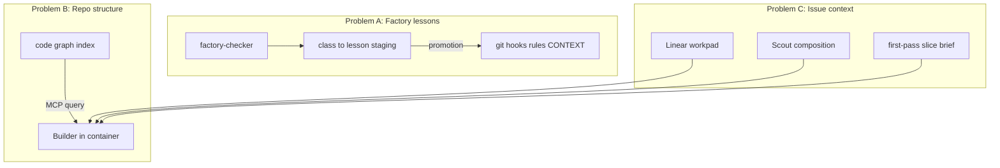

# Agent memory & code knowledge graphs — research

**Date:** 2026-09-01  
**Product:** KitCollective  
**Question:** Er Hermes (`pi-hermes-memory`) den rigtige persistence-model? Findes open source der er bedre? Hvordan passer knowledge graphs til container-per-issue sessions, så agenter ikke gen-opdager hele repoet ved hver spawn?

**Primary sources:** [ADR-0026](../../docs/adr/0026-worker-memory-on-kit-pi.md), [CONTEXT.md](../../CONTEXT.md), [Graphiti README](https://github.com/getzep/graphiti), [Mem0 OSS docs](https://docs.mem0.ai/open-source/overview), [Cognee README](https://github.com/topoteretes/cognee), [CodeGraph README](https://github.com/colbymchenry/codegraph), [codebase-memory-mcp](https://github.com/DeusData/codebase-memory-mcp), [Codebase-Memory paper](https://arxiv.org/html/2603.27277v1).

This file does not change factory config or Linear.

---

## Executive summary

**Hermes solves a narrow, factory-specific problem** — not general agent memory. It is a **staging store** for recurring checker lessons (`class → lesson`), with checker as sole writer, implement as reader, and **git ratchets as law** ([ADR-0026](../../docs/adr/0026-worker-memory-on-kit-pi.md), [CONTEXT.md](../../CONTEXT.md) Memory policy-only).

Replacing Hermes with Mem0, Graphiti, or Cognee for that job is **overkill and often wrong**: those systems optimize for conversational/user facts with LLM extraction on write. Your factory already has stronger promotion (`CONTEXT.md`, hooks, `.pi/first-pass-classes.json`).

**Graph engineering is logical — for a different layer:** structural **code intelligence** (symbols, call chains, blast radius), not factory lesson text. Open-source leaders here are **CodeGraph** (MIT, local SQLite, MCP, Cursor-native) and **codebase-memory-mcp** (MIT, tree-sitter, sub-ms queries). These address “agent must not re-learn the whole repo each spawn.”

**Recommendation:** two-layer memory architecture for Issue Session Sandbox:

| Layer | Purpose | Store | Lifetime |
|-------|---------|-------|----------|
| **A — Factory lessons** | Recurring Standards/Slop classes, route tuning | Slim harness-owned SQLite or markdown queue (Hermes semantics without Pi npm) | Global on worker volume |
| **B — Code structure** | Callers, imports, routes, impact | Shared read-only code graph index (CodeGraph `.codegraph/` on mirror) | Rebuilt on lane push; mounted into every session container |
| **C — Session ephemeral** | Composition, transcripts, workpad mirror | `sessions/KIT-n/` | Archived after Retro; not shared across issues |

Do **not** merge A+B into one graph DB unless you want to operate Neo4j/FalkorDB for ~50 lesson strings.

---

## What Hermes actually is (today)

From [harness/pi-job.mjs](../../harness/pi-job.mjs), [harness/worker-memory.mjs](../../harness/worker-memory.mjs), [harness/hermes-lessons.mjs](../../harness/hermes-lessons.mjs):

- Package: `npm:pi-hermes-memory` (Pi-specific; tied to Pi tool allowlists).
- Path: `/var/lib/kit-pi/hermes/failures.md` on `kit_pi` volume.
- Schema: `className → lesson` for Standards/Slop only — never Spec ([worker-memory.mjs](../../harness/worker-memory.mjs)).
- Injection: top-3 ranked lessons, max 800 chars, policy-only — no MEMORY.md dump.
- Writers: factory-checker (+ planned Retro). Readers: implement, Scout, helpers.
- Promotion: git ratchets win; checker calls `memory_remove` when class lands in hooks/rules.

Hermes is **not** a knowledge graph of the codebase. It is **operational memory staging** between “checker saw this twice” and “human/agent landed a ratchet.”

---

## Open-source “agent memory” landscape (2026)

Three popular families solve **conversation / user / evolving facts** — a different problem from factory lessons.

### Mem0 ([mem0ai/mem0](https://github.com/mem0ai/mem0), Apache-2.0)

- **Model:** LLM fact extraction on every `add()`; hybrid vector + keyword retrieval ([OSS overview](https://docs.mem0.ai/open-source/overview)).
- **Graph:** Mem0g / `enable_graph` **removed from OSS**; graph memory is Platform-only ([migration doc](https://docs.mem0.ai/open-source/graph-memory)).
- **Fit for KitCollective factory lessons:** **Poor.** Extraction can rewrite/merge lessons unpredictably; you need deterministic `class → lesson` with ratchet promotion, not semantic dedup of chat.
- **Fit elsewhere:** Per-user preferences, support bots, long chat sessions.

### Graphiti / Zep ([getzep/graphiti](https://github.com/getzep/graphiti), Apache-2.0)

- **Model:** Bi-temporal **context graph** — facts have `valid_at` / `invalid_at`; superseded facts stay auditable ([Graphiti README](https://github.com/getzep/graphiti), [arXiv:2501.13956](https://arxiv.org/abs/2501.13956)).
- **Ops:** Bring your own graph DB (Neo4j, FalkorDB, Kuzu, Neptune). Self-host = library + DB, not one binary.
- **Fit for factory lessons:** **Possible but heavy.** Useful if you need “what lesson was active when KIT-150 ran?” audit. Overkill if lessons are few and ratchets are the real source of truth.
- **Fit elsewhere:** CRM/support facts that change over time, compliance audit trails.

### Letta ([letta-ai/letta](https://github.com/letta-ai/letta), formerly MemGPT

- **Model:** Full **stateful agent OS** — agent self-manages core/recall/archival tiers via tools ([MemGPT paper](https://arxiv.org/abs/2310.08560)).
- **Fit:** **Wrong layer.** You are building a factory harness, not adopting an agent runtime. Replacing Pi with Letta swaps one runtime for another.

### Cognee ([topoteretes/cognee](https://github.com/topoteretes/cognee))

- **Model:** Ingest documents → self-hosted knowledge graph + vectors; `remember` / `recall` / session cache ([Cognee README](https://github.com/topoteretes/cognee)).
- **Ops:** Python stack; LLM on ingest; optional Postgres/Neo4j/LanceDB backends; Docker images available.
- **Fit for factory lessons:** **Heavy.** Good “company brain” if you ingest specs, ADRs, CONTEXT — but duplicates what git + workpad already provide.
- **Fit for code structure:** Can ingest code, but pipeline cost and latency exceed purpose-built code indexers.

### Comparison (factory-lesson use case)

| System | Write path | Deterministic lessons | Ops weight | Verdict for A-layer |
|--------|------------|----------------------|------------|---------------------|
| Hermes (current) | Harness checker, no LLM | Yes | Low (one markdown file) | Works; drop Pi npm dep |
| Custom SQLite | Harness checker | Yes | Low | **Best replacement** |
| Mem0 OSS | LLM extraction | No | Medium (Qdrant/SQLite) | Avoid |
| Graphiti | LLM entity extraction | Partial | High (graph DB) | Only if audit required |
| Letta | Agent-managed | No | High (full runtime) | Avoid |
| Cognee | LLM cognify pipeline | No | High (Python services) | Avoid for lessons |

---

## Code knowledge graphs (repo understanding)

These tools answer: *“What calls `syncToRemoteBranch`?”*, *“Blast radius of editing `bidding.ts`?”* — without grep-across-monorepo every spawn.

### CodeGraph ([colbymchenry/codegraph](https://github.com/colbymchenry/codegraph), MIT)

- Local `.codegraph/` index per repo; tree-sitter + call graph; **MCP tools** for agents ([README](https://github.com/colbymchenry/codegraph)).
- Lists **Cursor** as supported agent; auto-sync on file change; bundled runtime (no Node required for install path).
- Benchmark claim (project’s own): fewer tokens vs file exploration on architecture questions.

### codebase-memory-mcp ([DeusData/codebase-memory-mcp](https://github.com/DeusData/codebase-memory-mcp), MIT)

- Tree-sitter knowledge graph in SQLite; 15 MCP tools; static binary; hybrid LSP for types ([README](https://github.com/DeusData/codebase-memory-mcp)).
- Paper sibling: [Codebase-Memory arXiv:2603.27277](https://arxiv.org/html/2603.27277v1) — reports ~10× fewer tokens vs explorer on some tasks (author benchmark; treat as directional).

### GitNexus ([abhigyanpatwari/GitNexus](https://github.com/abhigyanpatwari/GitNexus))

- Deep MCP (16 tools), local LadybugDB — **PolyForm Noncommercial** license. **Not suitable** as default for KitCollective commercial product without license review.

### Cognee (again)

- Graph + vector over **documents**; better for unstructured knowledge than AST-precision call chains.

### Comparison (code structure use case)

| Tool | License | Storage | Cursor/MCP | Incremental | Verdict for B-layer |
|------|---------|---------|------------|-------------|---------------------|
| CodeGraph | MIT | `.codegraph/` SQLite | Yes | File watcher | **Primary candidate** |
| codebase-memory-mcp | MIT | SQLite | Yes (MCP server) | File watcher | Strong alternative |
| GitNexus | PolyForm NC | LadybugDB | Yes | Yes | License blocker |
| Graphiti | Apache-2.0 | External graph DB | Build yourself | Episode ingest | Wrong abstraction |
| Raw grep/read | — | — | — | — | Fallback only |

---

## Two problems — do not conflate



- **A** = “Don’t repeat anti-slop class X” → small deterministic store (Hermes semantics).
- **B** = “Don’t explore 400 packages from scratch” → shared structural index.
- **C** = “This ticket only” → session ephemeral; already partially built (Scout composition, [`first-pass.mjs`](../../harness/first-pass.mjs), [`implement-context.mjs`](../../harness/implement-context.mjs)).

Graph hype is **most justified for B**. For A, git ratchets remain authoritative; staging can stay boring.

---

## Architecture: Issue Session Sandbox + memory

Aligns with [Issue Session Sandbox plan](.cursor/plans/issue_session_sandbox_5a1105c8.plan.md) (container-per-issue, Retro before reap).

### Shared on host (outside containers, survives reap)

```
/var/lib/kit-factory/
├── mirror.git                 # bare mirror
├── hermes/                    # rename → factory-lessons/ (SQLite or failures.md)
├── codegraph/                 # OR .codegraph at mirror checkout — one index for all sessions
├── route-runs.sqlite
└── sessions/KIT-n/            # active session state (see plan)
```

### Per session container

- Git worktree checkout at `sessions/KIT-n/worktree/` (or linked worktree path).
- Read-only mount: **code graph index** (B-layer).
- Read-only mount: `CONTEXT.md`, `.cursor/rules/`, relevant spec slice.
- Read/write: session dir (transcripts, composition).
- **No** per-container full re-index of monorepo if B-layer is shared.

### Agent spawn injection order (deterministic, cheap)

1. **Git law:** `.cursor/rules/` + write-scope (already in implement-context).
2. **Ticket slice:** paths, Do not, prior fails, composition paths ([`first-pass.mjs`](../../harness/first-pass.mjs)).
3. **Factory lessons (A):** top-3 from lesson store ([`hermes-lessons.mjs`](../../harness/hermes-lessons.mjs) logic — keep ranking, drop Pi).
4. **Structural (B):** MCP tools available; prompt says “query codegraph before broad grep.”
5. **Not injected:** full repo tree, full CONTEXT dump, MEMORY.md, whole design-system lock.

### When to rebuild B-layer

- On push to `lanes.integration` (`development`): CI or host job runs `codegraph init` / sync against mirror.
- Session container mounts index read-only; optional session-local delta if agent edited files (CodeGraph auto-sync in worktree or post-commit hook).

### Retro (before reap)

Reads session transcripts (C) + checker findings → writes **A-layer** lessons + route-runs. Does **not** need to ingest entire codebase into Graphiti; optional: append session’s **changed-file subgraph** to B-layer only if you want cross-issue “we touched this module often” analytics (phase 2, not v1).

---

## Should you build slots the same way?

| Keep from Pi harness | Change for Cursor sandbox |
|----------------------|---------------------------|
| Slot = concurrency lease ([`job-queue.mjs`](../../harness/job-queue.mjs)) | Slot binds to **IssueSession**, not bare role |
| Capacity gate RAM/disk | Gate includes **codegraph index size** + session dir |
| Cheap in-slot retries | Same session container, same B-layer mount |
| Finisher on host (auto-merge/land) | Unchanged |
| Worktree isolation | Container wraps worktree |
| Reap at end | Reap after **Retro**, not at Done |
| Hermes global | **A-layer** global; drop `pi-hermes-memory` npm |

**Do not** put B-layer inside each container build — that duplicates index N times and defeats scale.

---

## Recommendations

### 1. Replace Hermes npm with harness-owned A-layer (not Mem0/Graphiti)

Implement `factory-lessons.sqlite` (or keep markdown + file lock):

- Same schema as [`worker-memory.mjs`](../../harness/worker-memory.mjs).
- Same writer/reader roles.
- Same promotion rules to git ratchets.
- Retro + checker as writers.

**Why not “better” OSS:** Mem0/Cognee/Graphiti add LLM writes, non-determinism, and ops you do not need for ~dozens of lesson classes.

**When to reconsider Graphiti:** If Nicklas needs audit-grade “lesson validity timeline” across compliance review — then a small Graphiti graph *only for lessons* (not code) could be justified.

### 2. Add B-layer: CodeGraph (or codebase-memory-mcp)

- Index monorepo once on worker against mirror.
- Wire MCP into Cursor session container ([CodeGraph supports Cursor](https://github.com/colbymchenry/codegraph)).
- Scout/Builder prompt: structural queries first, grep second.
- Measure: token use and tool-call count per issue vs baseline (KIT-150 class loops).

**Spike ticket:** mount read-only `.codegraph/` into one implement session; compare Scout phase duration/tokens.

### 3. Keep C-layer (session ephemeral) — already aligned

Composition + workpad + first-pass pack is the **issue-specific** graph. Do not duplicate in global KG.

### 4. Retro scope

- **In scope:** distill checker Standards/Slop classes → A-layer; route-runs tuning.
- **Out of scope v1:** full-repo Graphiti episode ingest from transcripts.

---

## Go / no-go

| Approach | Go? | Notes |
|----------|-----|-------|
| Keep Hermes semantics, drop Pi package | **Go** | Lowest risk cutover with Cursor |
| Mem0 for factory lessons | **No-go** | LLM extraction fights determinism |
| Graphiti for codebase | **No-go** | Wrong tool; use code indexer |
| CodeGraph shared index | **Go (spike)** | MIT, Cursor, local, matches container model |
| Cognee as unified memory | **Defer** | Heavy Python stack; overlaps git/docs |
| Letta as runtime | **No-go** | Replaces harness, not Hermes |

---

## Suggested next steps

1. ADR draft: **0032 — two-layer factory memory** (A: lessons SQLite, B: codegraph MCP, C: session ephemeral).
2. Spike: CodeGraph on `kit-collective` mirror + one Cursor implement session with MCP.
3. Migrate [`hermes-lessons.mjs`](../../harness/hermes-lessons.mjs) to read A-layer without Pi env vars.
4. Leave Graphiti/Cognee on watchlist for **product-facing** “company brain” (support, catalog ops) — not factory worker.

---

## Sources

- KitCollective: [ADR-0026](../../docs/adr/0026-worker-memory-on-kit-pi.md), [CONTEXT.md](../../CONTEXT.md) (Worker memory, First-pass pack, Mechanical close)
- Graphiti: https://github.com/getzep/graphiti — temporal context graphs, BYO graph DB
- Mem0 OSS: https://docs.mem0.ai/open-source/overview — vector + LLM extraction; graph removed from OSS
- Cognee: https://github.com/topoteretes/cognee — document→graph pipeline, MCP Docker image
- CodeGraph: https://github.com/colbymchenry/codegraph — local code graph, MCP, Cursor
- codebase-memory-mcp: https://github.com/DeusData/codebase-memory-mcp — tree-sitter KG, MCP
- Codebase-Memory paper: https://arxiv.org/html/2603.27277v1
- Code intelligence survey: https://rywalker.com/research/code-intelligence-tools (secondary aggregator; verify against project READMEs)
